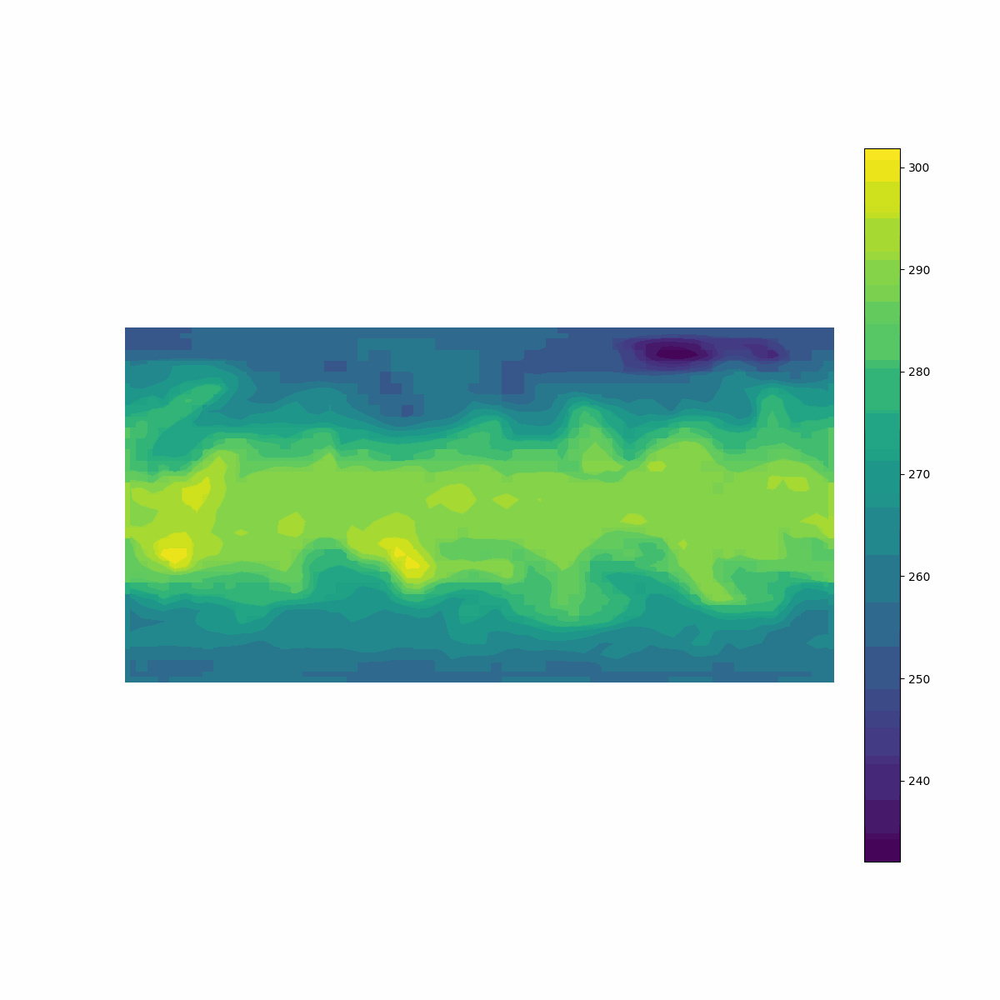
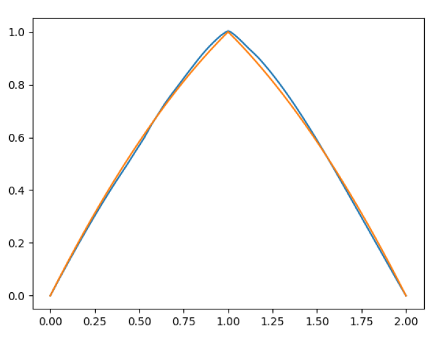
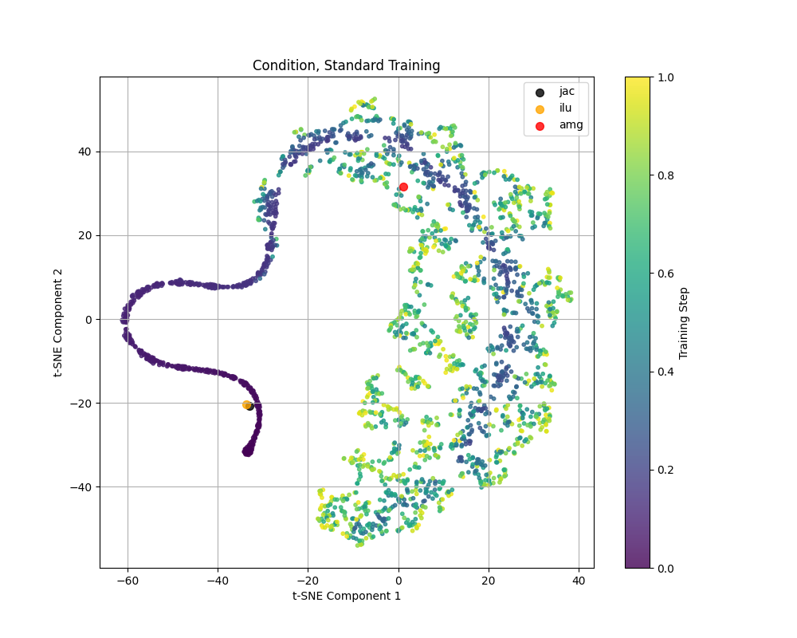
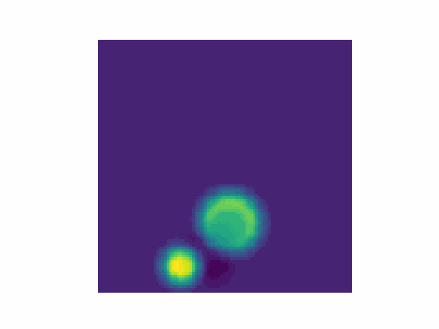

<!-- Google tag (gtag.js) -->

  

    
I am a double major in Computer Science and Statistics at the Rochester Institute of Technology (RIT). My research interests lie in probabilistic machine learning, multimodal systems, and weather forecasting. Currently, I am working at the intersection of diffusion models and weather forecasting to generate lightweight probabilistic modules that enhance the effectiveness of state-of-the-art deterministic models. I am affiliated with Lehigh University (under the advisement of Arielle Carr) and the Safe AI Lab at the Rochester Institute of Technology (under Ali Baheri).

    
I am actively seeking a doctoral program to further broaden my research and contribute to advancements in these fields.

    
Feel free to contact me at <a href="mailto:djm3622@rit.edu">djm3622@rit.edu</a>.

  

  

[//]: # <h1><b>Research</b></h1>

---

  
  

    <a href="https://github.com/djm3622/def-era"><strong>DEF: Diffusion-based Ensemble Forecasting</strong></a>
    
<b>David Millard</b>, Arielle Carr, Stephane Gaudreault, Carlos Pereira Frontado, Ali Baheri

    
Manuscript in progress.

  

  
  

    <a href="res/Mesh2025_1002.pdf"><strong>Deep Ritz Method for Elliptic Differential-Difference Equations</strong></a>
    
Anton Selitskiy, <b>David Millard</b>

    
Preprint.

  

  
  

    <a href="https://arxiv.org/abs/2501.10750"><strong>PEARL: Preconditioner Enhancement through Actor-critic Reinforcement Learning</strong></a>
    
<b>David Millard</b>, Arielle Carr, Stephane Gaudreault, Ali Baheri

    
Preprint.

  

  
  

    <a href="https://doi.ieeecomputersociety.org/10.1109/BigData62323.2024.10825166"><strong>Deep Learning for Koopman Operator Estimation in Idealized Atmospheric Dynamics</strong></a>
    
<b>David Millard</b>, Arielle Carr, Stephane Gaudreault

    
IEEE BigData, 2024

  

  
  

    <a href="https://doi.ieeecomputersociety.org/10.1109/BigData62323.2024.10825862"><strong>Data-Driven Initial Guess Selection for Numerical Weather Prediction Solvers</strong></a>
    
<b>David Millard</b>, Arielle Carr, Stephane Gaudreault

    
IEEE BigData, 2024

  

