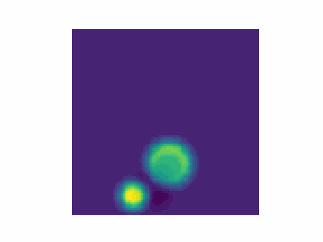

*todo*

<h1>Research</h1>

  
  

    <a href="https://github.com/yourusername/project"><strong>Time Invariant Operator Guided Diffusion</strong></a>
    
<b>David Millard</b>, Arielle Carr, Stephane Gaudreault

    
Manuscript in progress.

  

  
  

    <a href="https://github.com/yourusername/project1"><strong>PEARL: Preconditioner Enhancement through Actor-critic Reinforcement Learning</strong></a>
    
<b>David Millard</b>, Arielle Carr, Stephane Gaudreault, Ali Baheri

    
Manuscript in progress.

  

  
  

    <a href="https://github.com/yourusername/project2"><strong>Deep Learning for Koopman Operator Estimation in Idealized Atmospheric Dynamics</strong></a>
    
<b>David Millard</b>, Arielle Carr, Stephane Gaudreault

    
Manuscript in IEEE Big Data proceedings.

  

  
  

    <a href="https://github.com/yourusername/project3"><strong>Data-Driven Initial Guess Selection for Numerical Weather Prediction Solvers</strong></a>
    
<b>David Millard</b>, Arielle Carr, Stephane Gaudreault

    
Manuscript in REU Symposium at IEEE Big Data proceedings.

  

# Contact
*todo: link to resume, email.*
