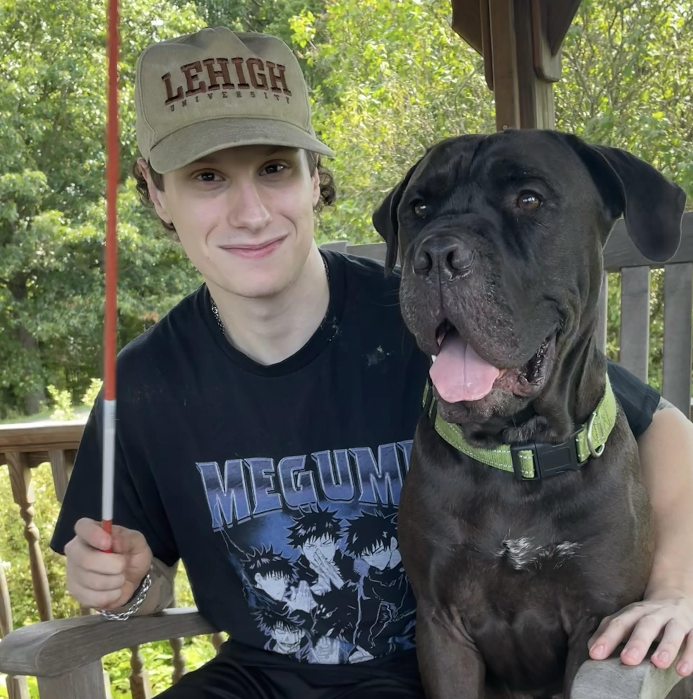

<!-- Google tag (gtag.js) -->

  

    
Hey! Rochester Institute of Technology (RIT)

    
Feel free to contact me at <a href="mailto:djm3622@rit.edu">djm3622@rit.edu</a>.

  

  

<h1><b>Research</b></h1>

---

  
  

    <a href="https://github.com/yourusername/project"><strong>Time Invariant Operator Guided Diffusion</strong></a>
    
<b>David Millard</b>, Arielle Carr, Stephane Gaudreault

    
Manuscript in progress.

  

  
  

    <a href="https://github.com/yourusername/project1"><strong>PEARL: Preconditioner Enhancement through Actor-critic Reinforcement Learning</strong></a>
    
<b>David Millard</b>, Arielle Carr, Stephane Gaudreault, Ali Baheri

    
Manuscript in progress.

  

  
  

    <a href="https://github.com/yourusername/project2"><strong>Deep Learning for Koopman Operator Estimation in Idealized Atmospheric Dynamics</strong></a>
    
<b>David Millard</b>, Arielle Carr, Stephane Gaudreault

    
IEEE Big-Data, 2024

  

  
  

    <a href="https://github.com/yourusername/project3"><strong>Data-Driven Initial Guess Selection for Numerical Weather Prediction Solvers</strong></a>
    
<b>David Millard</b>, Arielle Carr, Stephane Gaudreault

    
IEEE Big-Data, 2024

  

